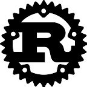

### **hi/salut 👋**
___

#### **facts**

about me:

* overview: `hands-on, generalist`
* bilingue: `français, english`
* non coding stuff: `hockey, golf`
* interests: `embedded systems, robotics, ai/ml, cybersecurity`
* see more: [`portfolio/blog link`](https://sebblanchet.github.io)

#### **stack**

right now:

    
    &nbsp;&nbsp;
    
    &nbsp;&nbsp;
    
    &nbsp;&nbsp;
    

