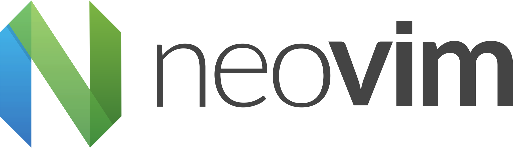

### **Hi/Salut 👋**
___

#### **Facts**

About me:

* Overview: `hands-on, generalist`
* Bilingue: `français, english`
* Non coding stuff: `hockey, golf`
* Interests: `embedded systems, robotics, ai/ml, cybersecurity`
* See more: [`portfolio/blog link`](https://sebblanchet.com)

#### **Stack**

Right now:

    
    &nbsp;&nbsp;
    
    &nbsp;&nbsp;
    
    &nbsp;&nbsp;
    
    &nbsp;&nbsp;
    

